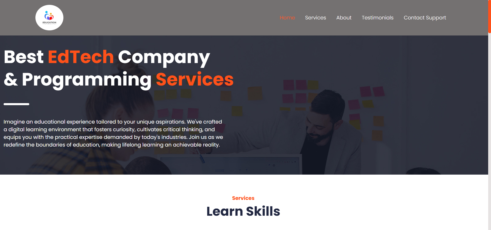
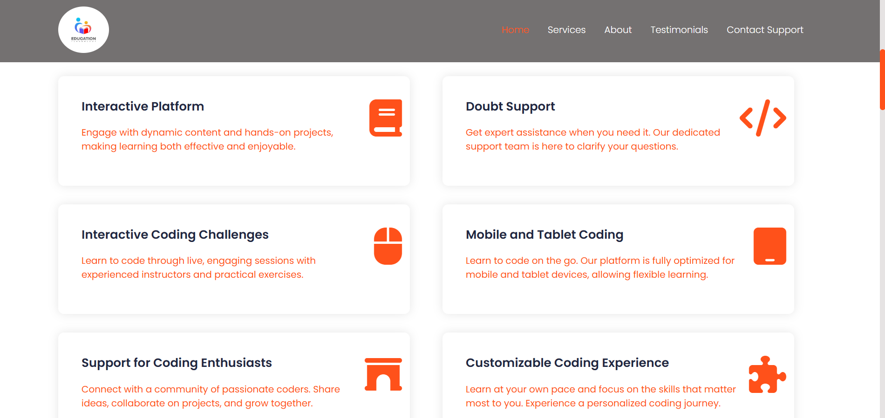
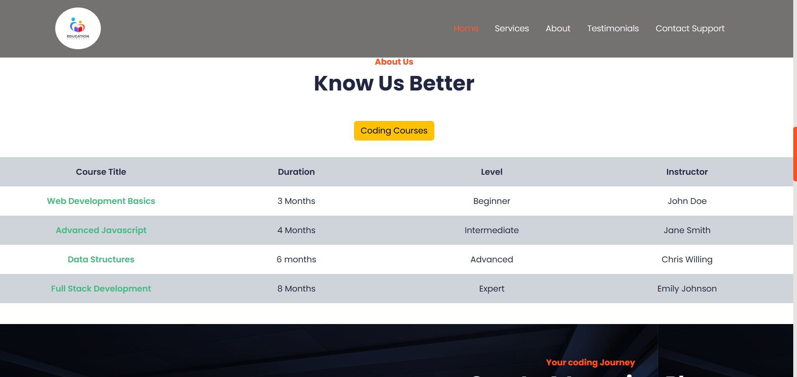
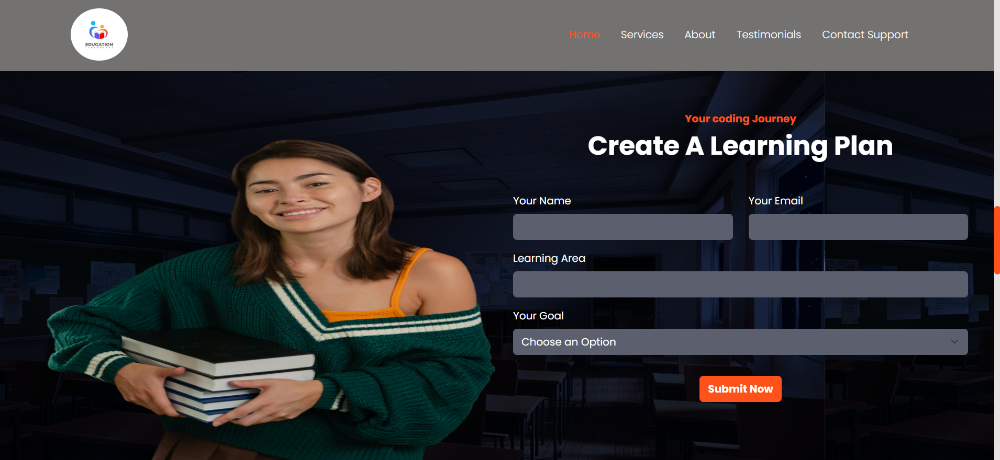
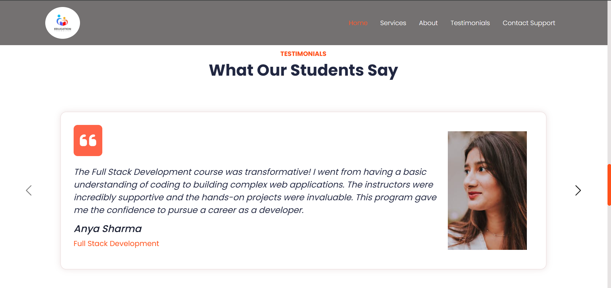
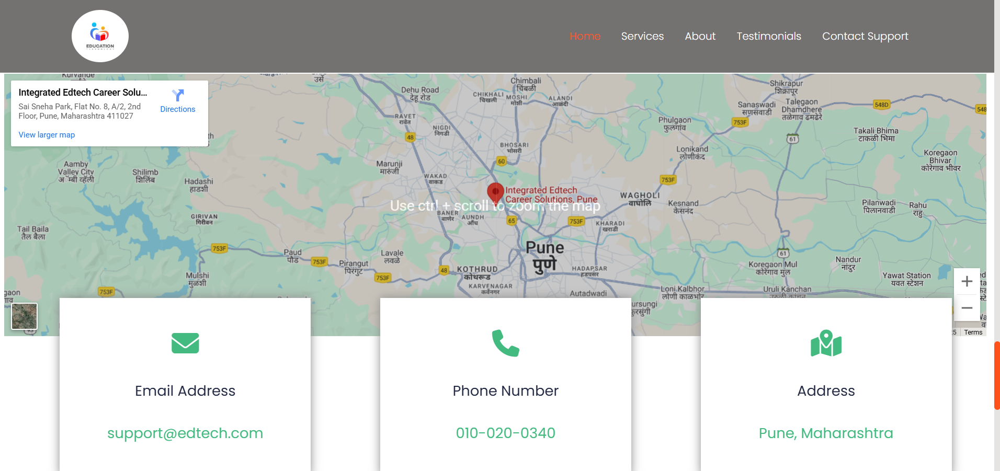

# EdTech Coding Co.

An educational technology and coding services website built with HTML and CSS, featuring a responsive design with Bootstrap. This project serves as a capstone to demonstrate proficiency in front-end web development by creating a modern, engaging, and mobile-friendly user experience.

---

## Features

This project includes several key sections to provide a comprehensive overview of the company's offerings:

* **Responsive Navigation Bar:** The navigation bar is designed to be fully responsive, with a classic horizontal menu on larger screens and a collapsible "hamburger" menu on smaller devices, powered by Bootstrap's JavaScript.
* **Hero Section:** A captivating hero section with a background image and a clear, concise headline to immediately grab the visitor's attention.
* **Services Section:** Highlights the key services offered, such as an interactive platform, doubt support, and customizable coding experiences, presented in a grid of cards.
* **Interactive Elements:** The project includes subtle animations and hover effects on service icons and buttons to create a more dynamic and engaging user experience.
* **About Us & Course List:** A dedicated section to introduce the company and provide a clear, organized list of available courses with details on duration, level, and instructor.
* **Dynamic Forms:** Two forms are included—one for creating a learning plan and another for general inquiries—to capture user information and encourage interaction.
* **Testimonials Carousel:** A responsive testimonial section using Bootstrap's carousel component to showcase student feedback. This is a great way to build credibility.
* **Contact Section:** Provides essential contact information and an embedded map for easy location, along with a dedicated inquiry form.
* **Aesthetics and Design:** The design uses a modern color palette with a vibrant primary color (`#ff511a`) and a secondary accent color (`#43ba7f`) to highlight key information. The layout is clean and easy to navigate.
* **Custom Scrollbar:** The website features a custom-styled scrollbar for a polished look.

---

## Technologies Used

* **HTML5:** For the page structure and content.
* **CSS3:** For all styling, including custom layouts and responsive design.
* **Bootstrap 5.3:** Used for the responsive grid system, navigation, and the testimonial carousel.
* **Font Awesome:** For scalable vector icons used throughout the site.
* **Google Fonts:** The "Poppins" font is used to provide a modern, clean typography.

---

## How to View the Project

To run this project locally, simply:

1.  Clone this repository to your local machine.
2.  Open the `index.html` file in your preferred web browser.

The project is self-contained and does not require any additional setup or a server to run.

---

## Project Structure

```
.
├── assets/
│   ├── images/
│   │   ├── banner-bg.jpg
│   │   ├── hero-bg.jpg
│   │   ├── logo.jpg
│   │   ├── pic.png
│   │   ├── testimonials-01.jpg
│   │   ├── testimonials-02.png
│   │   └── testimonials-03.jpg
├── index.html
└── index.css
```


## OUTPUT SCREENSHOTS

### Hero Section


### Services Section


### About Section


### Interest Form


### Testimonials Section


### Contact us Section

